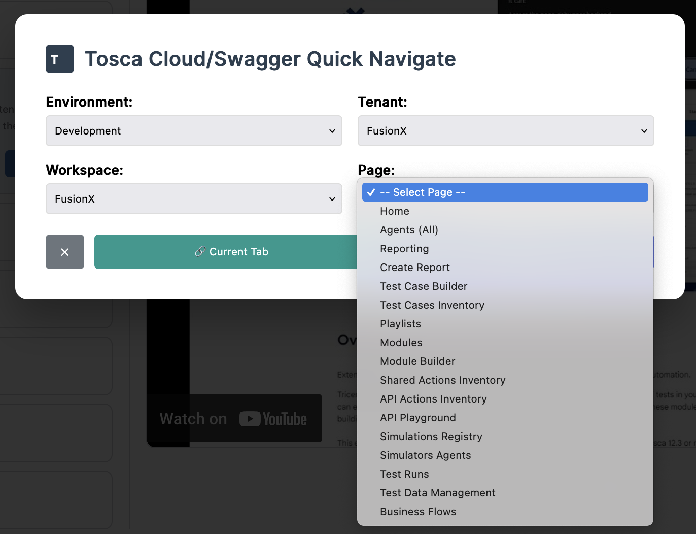

# Tosca Cloud Navigator

A browser-based tool for quick navigation between Tosca Cloud environments, tenants, and workspaces.




## 🚀 Quick Start

### Setup

1. **Copy configuration file:**

   **Start with Tricentis**

   ```bash
   cp config.example.json config.json
   ```

   **Start with FusionX**

    ```bash
    cp config.fusionx.json config.json
    ```

2. **Serve via HTTP server** (required to load custom config):

   ```bash
   # Option 1: Python
   python3 -m http.server 8000

   # Option 2: Node.js
   npx serve .

   # Option 3: PHP
   php -S localhost:8000
   ```

3. **Open in browser:**

   ```bash
   http://localhost:8000
   ```

### Option 1: Bookmarklet (Recommended)

1. Visit the tool at `http://localhost:8000`
2. Go to the **Bookmarklet** tab
3. Drag the "📌 Tosca Cloud Navigator" link to your browser's bookmark bar
4. Click the bookmark from any page to open the quick navigator popup

### Option 2: Direct Access

Open the tool directly in your browser to access the full interface with configuration options.

> **Note:** Opening `index.html` directly (`file://` protocol) will use built-in configuration due to CORS restrictions. Use an HTTP server to load your custom `config.json`.

## ✨ Features

### Smart Defaults

- **Auto-selects FusionX** as the default tenant and workspace when available
- **Auto-populates fields** when you're already on a Tosca Cloud page
- **Remembers your configuration** using local storage

### Navigation Options

- **Environment Selection**: Development, Staging, Production
- **Tenant Selection**: FusionX, Tricentis-CI, Tricentis
- **Workspace Selection**: FusionX, Reporting, API-Simulator, Swagger Docs, and more
- **Page Selection**: Home, Agents, Test Cases, Reports, API Playground, etc.
- **Custom Paths**: Enter any custom path for direct navigation

### Multiple Access Methods

- **Current Tab**: Navigate in the same tab
- **New Tab**: Open in a new browser tab
- **Bookmarklet**: Quick access from any page

## 🎯 Usage Examples

### Basic Navigation

1. Select your environment (e.g., "Development")
2. Tenant automatically selects "FusionX"
3. Workspace automatically selects "FusionX"
4. Choose a specific page or leave default
5. Click "Open in Current Tab" or "Open in New Tab"

### Custom Navigation

- Use the "Custom Path" field to navigate to specific URLs like `/your/custom/path`
- The tool will build the complete URL: `https://fusionx.my-dev.tricentis.com/your/custom/path`

### Smart Auto-Population

When you're already on a Tosca Cloud page (like `https://fusionx.my-dev.tricentis.com/_portal/space/FusionX/home`):

- Environment automatically selects "Development"
- Tenant automatically selects "FusionX"
- Workspace automatically selects "FusionX"
- Ready to navigate to other pages in the same context

## 🔧 Configuration

### Initial Setup

1. **Copy the example config:**

   ```bash
   cp config.example.json config.json
   ```

2. **Edit `config.json`** to match your environments:
   - Update environment URLs (`my-dev`, `my-test`, `my`)
   - Add your tenants and workspaces
   - Customize available pages and swagger endpoints

3. **Refresh the browser** after making changes to load the new configuration

### Adding New Environments

1. Go to the **Configure** tab
2. Use the **Visual Editor** to add new environments
3. Or edit the **JSON Configuration** directly for bulk changes

### Adding New Workspaces

1. In the **Configure** tab, add workspaces to the shared library
2. Assign workspaces to specific tenant/environment combinations
3. Choose workspace types:
   - **Portal Workspace**: Standard Tosca Cloud portal spaces
   - **Custom Path**: Direct links to specific URLs
   - **Swagger**: API documentation endpoints

### Configuration Management

- **Export**: Copy your configuration JSON to share with team members
- **Import**: Paste configuration JSON to quickly set up the tool
- **Reset**: Return to default configuration at any time

## 📚 Available Workspaces

### Standard Workspaces

- **FusionX**: Main development workspace
- **Reporting**: Analytics and reporting tools
- **API-Simulator**: API testing and simulation
- **Swagger Docs**: API documentation

### Available Pages

- **Home**: Dashboard and overview
- **Agents**: Agent management and monitoring
- **Test Cases**: Test case inventory and management
- **Builder**: Test case and module builders
- **Playlists**: Test execution playlists
- **API Playground**: Interactive API testing
- **Reporting**: Report creation and viewing
- **TDM**: Test Data Management

## 🌐 Supported Environments

- **Development** (`my-dev.tricentis.com`)
- **Staging** (`my-test.tricentis.com`)
- **Production** (`my.tricentis.com`)

## 💡 Tips & Tricks

### Bookmarklet Best Practices

- **Drag from the source page** to ensure you get the latest version
- **Refresh your browser** after configuration changes to update the bookmarklet
- **Use keyboard shortcuts** (like Ctrl/Cmd+Click) to open in new tabs

### Workflow Optimization

1. **Start from Tosca Cloud pages** to leverage auto-population
2. **Use FusionX defaults** for most common navigation scenarios
3. **Save custom configurations** for team-specific setups
4. **Share configuration JSON** with team members for consistency

### Troubleshooting

- **Clear browser cache** if favicons don't update
- **Re-drag bookmarklet** after making configuration changes
- **Check URL patterns** if auto-population isn't working
- **Verify JSON syntax** when importing configurations

## 📋 Team Setup

### For Team Leaders

1. Configure the tool with your team's specific environments and workspaces
2. Export the configuration JSON
3. Share the configuration and bookmarklet setup instructions
4. Consider hosting the tool on a shared internal server

### For Team Members

1. Import the shared configuration JSON
2. Set up the bookmarklet for quick access
3. Customize additional workspaces as needed for your specific workflows

## 🔄 Updates

The tool automatically saves your configuration locally. When sharing updates:

1. Export your current configuration as backup
2. Import the new shared configuration
3. Merge any personal customizations as needed

---

**Need help?** Contact your team administrator or check the tool's built-in help documentation.
